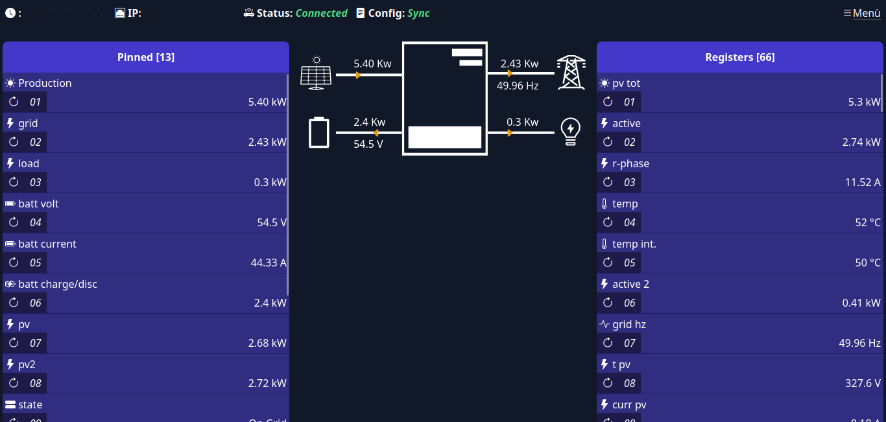
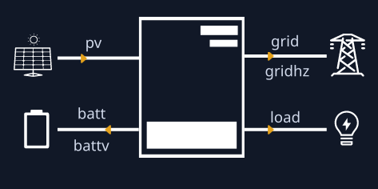

# ModbusMon



a WIP nodejs application to monitor your inverter through modbus tcp

**server requirements:**

- linux (should work on other OSes too but they are untested and unsupported)
- recent nodejs (stable, should work on lts but it is not supported)
- yarn

**client requirements:**

- recent browser (tested on firefox and chromium)

**how to build:**
- run build.sh

**how to run:**
- open a terminal in `dist/server` folder
- type `yarn start`

**TODO**
- other register types (holding is the only one atm)
- rtu/mqtt? converter

**features**
- squash adjacent register reads to greatly increase performance
- sqlite3 database
- two start modes: fast (instant boot) and slow (pre-load all registers at boot)
- mobile friendly
- config editor in UI
- more

---

# Config files

user files must be put in `dist/user` directory.

an empty folder is created when running, if not found, or you can create it yourself.

## user directory structure

- certs/
    - mycert.crt
    - mycert.key
- cfg/
    - config.yaml
    - db.yaml
    - logger.yaml
    - server.yaml
- log.txt
- log.txt_old
- modbusmon.db

---

## config.yaml

`modbus config file`

```text
host: xxx.xxx.xxx.xxx         // serial converter address
hostConnectTimeout: 10        // serial converter connection timeout in seconds [optional, default 10, min 1]
hostRequestTimeout: 5         // serial converter data request timeout in seconds [optional, default 5, min 1]
port: xxx                     // serial converter port [optional, default 502]
fastStartup: true             // server start mode [optional, default true]
                              // false: read all registers at boot to fill all the fields in UI
                              // true: show N/A until the register is read, according to its interval
registers:
    [registers items]
combined:
    [combined items]
```

### registers item example
```yaml
- label: Inverter status // register UI label
  adr: "0x404"           // address, double quote hex string
  interval: 10m          // read interval in s/m/h/d (seconds/minutes/hours/days), min 4s [optional, default 6, default s]
  icon: hdd-stack        // icon in UI [optional, bootstrap-icon]
  pin: true              // show this register in "Pinned" section [optional, default false]
  unit: Kwh              // unit [optional]
  hide: false            // do not show in UI [optional, default false]
  ui: load               // inverter UI slot [optional]
  input:
    type: holding         // register type [optional, default holding]
    size: u16             // register size [optional, default u16]
    scale: 0.01           // scaling [optional]
    fn: inverterStatusStr // custom parsing function (functions.ts) [optional]
```

register address must be inside double quotes in the form `"0xabc"`

### valid values

#### ui
* load
* batt
* battv
* pv
* grid
* gridhz



#### type
* holding
* coil
* input
* discrete

#### size
* u16
* i16
* u32
* i32
* u64
* i64
* ascii
* bcd16

#### scale
from _0.01_ to _1_

#### fn
name of the function defined in ZcsFn.ts or CustomFn.ts

### combined item example
```yaml
- label: Total PV prod.   // combined UI label
  icon: hdd-stack         // icon in UI [optional, bootstrap-icon]
  unit: Kwh               // unit [optional]
  pin: true               // show this combined in "Pinned" section [optional]
  hide: false             // do not show in UI [optional, default false]
  ui: pv                  // inverter UI slot [optional]
  input:
    fn: inverterStatusStr // custom parsing function
    links:                // list of registers to link to this combined, they must be defined in registers
        - "0x404"         // linked register address
        - "0x504"         // linked register address
```

---

## logger.yaml

`logger config file`

```yaml
debug: false        // enable logging [optional, default false]
maxFileSize: 200mb  // max log file size [optional, default 200]
```

---

## db.yaml

`database config file`

```yaml
maxHistoryDays: 14 // delete data older than X days [optional, default 14]
```

---

## server.yaml

`modbusmon server config file`

```yaml
port: 8340 // server port [default 8340]
sec: true // enable helmet protection and https (requires certs) [optional, default false]
```